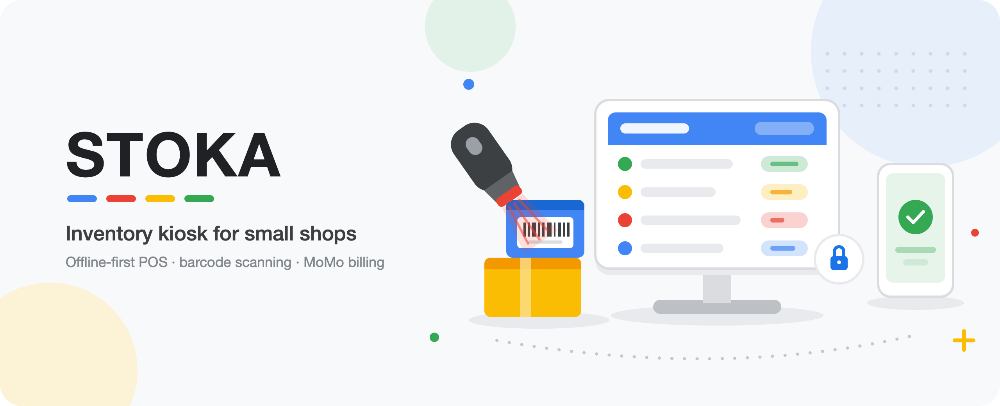

<p align="center">
  
</p>

<h1 align="center">StokaFlow</h1>

<p align="center">
  Multi-tenant inventory SaaS for small businesses — built for shops still running stock on Excel.
</p>

<p align="center">
  
  
  
  
  
</p>

> **This is a case study, not the source.** StokaFlow is a commercial product and its
> code is private. This repo documents how it's built. Code walkthroughs available on request.

---

## The problem

Small retailers in Rwanda track inventory in Excel, or in a notebook. The existing software
competitors are all bring-your-own-device — which assumes the shop already owns a tablet and
someone who knows how to set it up. Most don't.

StokaFlow is the software half of a hardware + software lease: a tablet kiosk and barcode
scanner, bundled with the app, on a monthly subscription. Removing the upfront hardware cost
is the wedge; the app has to be good enough that they stay.

That constraint drove most of the engineering decisions below — the users are not technical,
the devices are shared, and staff turnover is high.

---

## Architecture

```
┌────────────────────────────────────────────────────────┐
│  Next.js 14 App Router  (TypeScript · Tailwind)        │
│                                                         │
│   (app)/  ── authed shell: sidebar, topbar, guard      │
│   /       ── marketing landing                          │
│   api/    ── route handlers: signup, invite, login      │
└───────────────┬────────────────────────────────────────┘
                │  @supabase/supabase-js
    ┌───────────┴───────────┐
    │  anon key (browser)   │  → RLS enforced
    │  service role (server)│  → RLS bypass, server-only
    └───────────┬───────────┘
                │
┌───────────────┴────────────────────────────────────────┐
│  Supabase — Postgres + Auth                            │
│   Row Level Security on every table                    │
│   current_company_id() / current_effective_role()      │
│   movement → quantity trigger                          │
└────────────────────────────────────────────────────────┘

  Deploy:  multi-stage Docker → Cloud Build → Artifact Registry → Cloud Run
```

### Data model

Every table is tenant-scoped by `company_id`. Nothing is global.

```
companies ──┬── users        (role: admin | manager | employee, elevated flag)
            ├── categories ── products ── movements  (type: in | out)
            └── plan          (starter | standard | premium)
```

---

## Engineering decisions worth explaining

### Tenant isolation lives in Postgres, not in the app

The obvious way to build multi-tenant is to filter by `company_id` in every query. That works
until one query forgets the filter, and then Shop A sees Shop B's stock.

Instead, isolation is enforced by **Row Level Security policies** in Postgres, using two
`SECURITY DEFINER` helpers — `current_company_id()` and `current_effective_role()`. The app
sends the query; the database decides what rows exist. A forgotten `WHERE` clause returns
nothing instead of leaking. Tenant isolation was verified between two live companies.

The service-role client that bypasses RLS is isolated in its own module, guarded by the
`server-only` package so importing it from a Client Component is a **build-time error**,
not a production incident.

### Staff without email addresses

Supabase Auth requires an email per user. Shop employees frequently don't have one.

Rather than forcing a fake-email workflow onto the shop owner, auth is hybrid:

| Staff has email? | Flow |
|---|---|
| Yes | Standard magic-link invite → `/accept-invite` → set password |
| No | Owner sets a username + temp password in the dashboard |

Username logins resolve through a per-company slug, so two different shops can both have an
employee called `john`. Under the hood those accounts get a synthetic
`username@<company-slug>.internal` address, which never surfaces in the UI.

### Locked features stay visible

Plan tiers (Starter / Standard / Premium) are one codebase, not three builds. Features the
shop hasn't paid for render **disabled with a lock icon** rather than disappearing.

Hiding them makes upgrading feel like buying a different product. Showing them makes it feel
like unlocking the one you already use.

### Barcode scanning without a native app

Stock-in and stock-out share one component that accepts three input paths — fuzzy product
search, exact SKU entry, and live camera scan via `html5-qrcode`. The camera path needs HTTPS,
so it was tested end-to-end on a physical phone through an ngrok tunnel rather than assumed
to work.

Stock-out rejects over-withdrawal at the database level; a Postgres trigger keeps
`products.quantity` consistent with the movement ledger so the two can't drift.

### Pinned to Next 14 on purpose

The build machine runs Node 18.17.1 with no version manager available. Next 15+ requires
Node 20+. Rather than a fragile toolchain upgrade mid-build, the version is pinned and the
constraint is documented where the next person will hit it.

That decision has a downstream cost: `@supabase/realtime-js` expects a native `WebSocket`,
which Node 18 doesn't have. Both Supabase clients inject a `ws` polyfill — the browser client
does it conditionally, so the Node-only module never lands in the client bundle.

### Build-time secrets vs runtime secrets

`NEXT_PUBLIC_*` values are inlined into the client bundle at build time, so they must arrive
as Docker build args. The service-role key must *not* — but Next's build-time page-data
collection still instantiates the admin client, so the build would crash without some value.

The Dockerfile passes an explicit `build-time-placeholder`; Cloud Run injects the real key at
runtime. The real secret never enters an image layer.

---

## Stack

| | |
|---|---|
| **Framework** | Next.js 14.2, App Router, route groups, standalone output |
| **Language** | TypeScript 5, `strict: true` |
| **UI** | Tailwind CSS 3.4 with a custom token set · Recharts · lucide-react · Inter |
| **Data** | Supabase — Postgres + Auth, RLS policies, enums, triggers, SQL migrations |
| **Scanning** | html5-qrcode |
| **Container** | Multi-stage Docker on Node 18 Alpine |
| **CI/CD** | Google Cloud Build → Artifact Registry → Cloud Run (`europe-west1`) |

No ORM — hand-written SQL migrations and a typed query layer. No state-management or
data-fetching library; App Router server components and local state cover it.

---

## Status

**Pre-pilot.** The application is feature-complete against a live Supabase backend and the
deploy pipeline is written, but it has not been through a real shop yet.

| Area | State |
|---|---|
| Inventory, products, categories, movements | Live against Postgres |
| Auth, roles, tenant isolation | Live, verified across two companies |
| Stock-in / stock-out incl. camera scan | Live, tested on real hardware |
| Users, settings, company profile | Live |
| Reports | Still on mock data |
| Plan gating | Cosmetic — not yet enforced server-side |
| Cloud Run deploy | Config written, not yet deployed |
| Tests | None |

Known gaps are tracked rather than hidden — password reset, server-side plan enforcement,
and the reports rebuild are the next three items.

---

## Screenshots

_Coming — dashboard, inventory, stock-in scan flow, mobile drawer._

---

<p align="center">
  <sub>Built by <a href="https://github.com/Arcade0101">@Arcade0101</a> · source private · ask for a walkthrough</sub>
</p>
